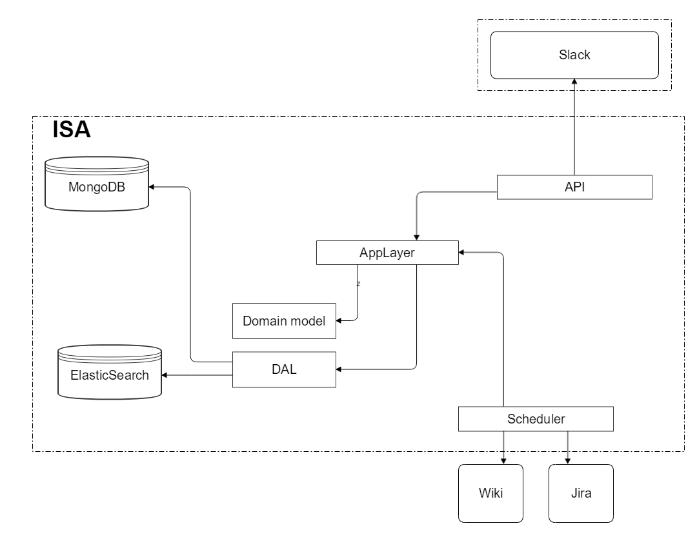

To start using ISA, you should create [Slack application](https://api.slack.com/apps?new_app=1)
and set up an endpoint accessible from outer network. It's necessary because slack will
deliver all events to this endpoint. You can find more information [here](https://api.slack.com/events-api).
For development purposes you may use ngrok.

#### 1. <a name="ngrok"></a>Ngrok (Optional)
  - Download [ngrok](https://ngrok.com/)
  - Launch it: `ngrok http 5000` (ISA api running on this port)
---

#### 2. elasticsearch

#####  Docker way
Go to [step 4](#step-four)

##### Ordinary way
- ##### Automatic
   - Download and install [Elastic](https://www.elastic.co/downloads/elasticsearch)
   - Set up your elastic address in **appsettings.json**
   - Make sure curl and java 8 are installed. You could easily install [curl](https://chocolatey.org/packages/curl) using [chocolatey](https://chocolatey.org/) (on Windows)
   - Launch Elastic
   - Launch `./scripts/start.bat` and specify the full path to elasticsearch  `config` folder. You could also specify optional argument **Url Elastic** = http://localhost:9200
      * Example
         ```
         start.bat {path_to_elastic}\{version}\config http://localhost:9200
         ```

    + Make sure `mongo`, `elastic`, `ISA` are laucnhed
- ##### Manual
    + Download and install [Elastic](https://www.elastic.co/downloads/elasticsearch).
     Put all folders from `./additionalConfig/elasticsearch` into elastic `config` folder.

     Make sure the following files are there:
     + [Russian and english dictionaries of synonyms and acronyms ](https://www.elastic.co/guide/en/elasticsearch/reference/current/analysis-synonym-tokenfilter.html):
        1. ./additionalConfig/elasticsearch/solrSynonyms/ru_RU/synonyms.txt
        2. ./additionalConfig/elasticsearch/solrSynonymsAcronyms/en_US/synonymsAcronyms.txt

     + [Huspell dictionary for russian and english](https://www.elastic.co/guide/en/elasticsearch/reference/current/analysis-hunspell-tokenfilter.html):
       1. ./additionalConfig/elasticsearch/hunspell/ru_RU/ru_RU.aff
       2. ./additionalConfig/elasticsearch/hunspell/ru_RU/ru_RU.txt
       3. ./additionalConfig/elasticsearch/hunspell/en_US/en_US.aff
       5. ./additionalConfig/elasticsearch/hunspell/en_US/en_US.txt
     + Launch Elastic
     + Make sure curl and java 8 are installed. You could easily install [curl](https://chocolatey.org/packages/curl) using [chocolatey](https://chocolatey.org/) (on Windows)
     + Create elasticsearch questions and answers indexes using the following files:
       ./additionalConfig/elasticsearch/questionsIndex
       ./additionalConfig/elasticsearch/answersIndex
        ```
        curl -X PUT {url}/{index} -d "@{nameOfIndexFile}" -H "Content-Type: application/json"
        curl -X PUT http://localhost:9200/questions -d "@questionsIndex.json" -H "Content-Type: application/json"
	    ```
    + Make sure `mongo`, `elastic`, `ISA` are laucnhed

#### 3. <a name="step-four"></a>Parameters
In order to search by Jira and Confluence, it is necessary to register the login and password
of the Atlassian account in appsettings.json, as well as specify `SpaceKeys`
(in the case of Confluence) and` ProjectNames` (in the case of Jira).

#### 4. Build

#####  Docker way
To start the application you must run the script:
```
.\scripts\dev-docker.rebuild-and-run.cmd
```
Then you could add your endpoints in slack application management (see `Dependencies`) and that's it.

##### Ordinary way
Build and run API from the IDE. To get data from Confluence and Jira, run the scheduler.

---

#### 5. Slack

1. Subscribe to slack events on tab `https://api.slack.com/apps/{yourAppId}/event-subscriptions?`.
**Important:** application must be running. Add your url `https://{yourEndpointAddress}/api/slack/events`.
in case of success, the input field will be written in green *Verified*.
2. Add bot user on tab `https://api.slack.com/apps/{yourAppId}/bots?`
3. On the '*Event subscriptions*' tab, you must subscribe your app to **message.im** (under "**Subscribe to Bot Events**").
4. Subscribe to interactive messages on tab `https://api.slack.com/apps/{yourAppId}/interactive-messages?`.
(like that `https://{yourNgrokAddress}/api/slack/interactivemessages`)
5. Add permission **channels:history** on tab `https://api.slack.com/apps/{yourAppId}/oauth?`.
6. Go to `https://api.slack.com/apps/{yourAppId}/general?`, copy your **signing secret**
and paste into project's **appsettings.json** (*SlackSettings*)
7. Install application `https://api.slack.com/apps/{yourAppId}/general?`.
8. Finally, copy your **Bot User OAuth Access Token** into **appsettings.json**.

After that, rebuild an application (in order to apply slack oauth settings) 

## Tests

When using Docker, tests are run during the build process of docker images. Otherwise, run the following script:
```
.\scripts\dev.tests.cmd
```

## Architecture

